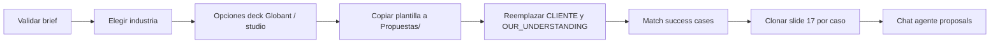

# Armado de propuestas — decks y plantilla Slides

Flujo en la Web App (**Armado de propuestas**): validar brief (RFP/chat/adjuntos) → elegir industria → copiar plantilla Google Slides → personalizar placeholders y casos de éxito → chat con agente `proposals`.

Código principal: `gas/application/ProposalBuildingService.js`, `gas/application/ProposalBuildingSlidesService.js`.

## Script Properties

Configurar en Apps Script → ⚙️ → *Propiedades del script*:

| Propiedad | Descripción | Obligatorio |
|-----------|-------------|-------------|
| `DRIVE_ROOT_FOLDER_ID` | Carpeta raíz del proyecto en Drive. Los decks armados se guardan en `{raíz}/Propuestas/`. El material del catálogo (Contenidos → propuesta) va en `{raíz}/Propuestas/Catalogo/…`. | Sí |
| `PROPOSAL_DECK_AIRLINES_ID` | ID de la **presentación Google Slides** plantilla para industria Aerolíneas (español). | Sí (si usás aerolíneas) |
| `PROPOSAL_DECK_LOGISTICS_ID` | ID de la plantilla para Logística. | Sí (si usás logística) |

Los IDs son el fragmento de la URL de Drive: `https://docs.google.com/presentation/d/{ID}/edit`.

### Requisitos de la plantilla

- Debe ser **Google Slides nativo** (`application/vnd.google-apps.presentation`). Un `.pptx` subido sin convertir a Slides **no** sirve.
- La cuenta que ejecuta el script (despliegue «Ejecutar como: yo») debe poder **leer** la plantilla y **escribir** en `DRIVE_ROOT_FOLDER_ID`.
- Mantener los placeholders **exactos** (sensible a mayúsculas):

| Placeholder | Uso |
|-------------|-----|
| `{CLIENTE}` | Cualquier slide — reemplazo global por el cliente del brief validado. |
| `{Titulo}` | Título corto del alcance (ej. «Desarrollo Plataforma de Gestión»), derivado de los ítems del brief. |
| `{OUR_UNDERSTANDING}` | Cualquier slide — texto narrativo «Nuestro cliente {X} está solicitando lo siguiente:» con viñetas; títulos en **negrita**, descripciones en *cursiva*. |
| `{ITEMS_AGENDA}` | Ítems de agenda, un título por línea (sin números ni viñetas; la plantilla los formatea). |
| `{SEC_NUM}` | En cada slide del bloque de sección (Globant 4–8, studio 9–11, entendimiento 12, solución 14, casos 16): número reordenado 1…N si se omiten bloques. |
| `{Casos_de_Exito}` | **Slide 16** (y clones) — título del caso de éxito. |
| `{CASO_EXITO_CONTENTS}` | **Slide 16** (y clones) — por qué encaja + resumen + enlace al PDF/URL en Drive. |

Secciones opcionales (plantilla aerolíneas, índices 1-based): slides **4–8** (Somos Globant), **9–11** (studio aerolíneas). El wizard permite omitirlas antes de armar el deck.

La **slide 16** (numeración 1-based, como en el editor de Slides) es la plantilla de casos de éxito. Al armar la propuesta:

1. Se buscan hasta **6** success cases del catálogo relevantes al brief e industria (similitud léxica + embeddings).
2. Si hay **N** casos: se personaliza la slide 16 y se **clonan N−1** slides adicionales (una por caso).
3. Si **no** hay casos aplicables: se **elimina** la slide de plantilla de casos de éxito.

Nombre del archivo copiado en Drive: **`{Cliente} - {Alcance}`** (derivado del brief; ver `ProposalBuilding_buildProposalFileName_`).

## APIs y permisos (manifiesto)

En `gas/appsscript.json`:

- Scope `https://www.googleapis.com/auth/presentations`
- Scope `https://www.googleapis.com/auth/drive` (ya existente)
- Servicio avanzado **Google Slides API** (`Slides` v1) en `dependencies.enabledAdvancedServices`

Tras `clasp push` y nueva versión de la Web App:

1. Verificar en el editor GAS que aparece el servicio **Slides** (Servicios → Google Slides API).
2. Los usuarios deben **re-autorizar** la app si cambiaron los scopes.

## Permiso de producto

Rol con `view_proposal_building` (por defecto en Presales). Ver `gas/application/AdminRoleConfigService.js`.

## Flujo operativo (resumen)



## Despliegue

```bash
npm run build:css   # si hubo cambios de UI
clasp push          # solo con consentimiento explícito
./deploy            # build + push + redeploy Web App
```

## Checklist plantilla (aerolíneas)

- [ ] Slides en español, formato Google Slides (no PPTX crudo).
- [ ] `{CLIENTE}`, `{OUR_UNDERSTANDING}` y `{ITEMS_AGENDA}` en las slides que correspondan.
- [ ] `{SEC_NUM}` en cada slide de sección (4–8, 9–11, 12, 14, 16); no usar números fijos `1`…`5`.
- [ ] Slide 16 con `{Casos_de_Exito}` y `{CASO_EXITO_CONTENTS}` en título/cuerpo.
- [ ] `PROPOSAL_DECK_AIRLINES_ID` apunta al file ID correcto.
- [ ] `DRIVE_ROOT_FOLDER_ID` accesible por la cuenta del despliegue.
- [ ] Success cases indexados en el catálogo con `drive_file_url` para hipervínculos en el deck.

## Errores frecuentes

| Mensaje / síntoma | Causa habitual |
|-------------------|----------------|
| Plantilla no configurada | Falta `PROPOSAL_DECK_*_ID` en Script Properties. |
| No es Google Slides | Plantilla es PPTX u otro MIME; convertir en Drive a Slides. |
| Slides API no disponible | Servicio avanzado no habilitado tras el push; habilitar en editor GAS. |
| Slide 17 omitida | Plantilla con menos de 17 slides, o sin casos de éxito match (se borra la slide plantilla). |
